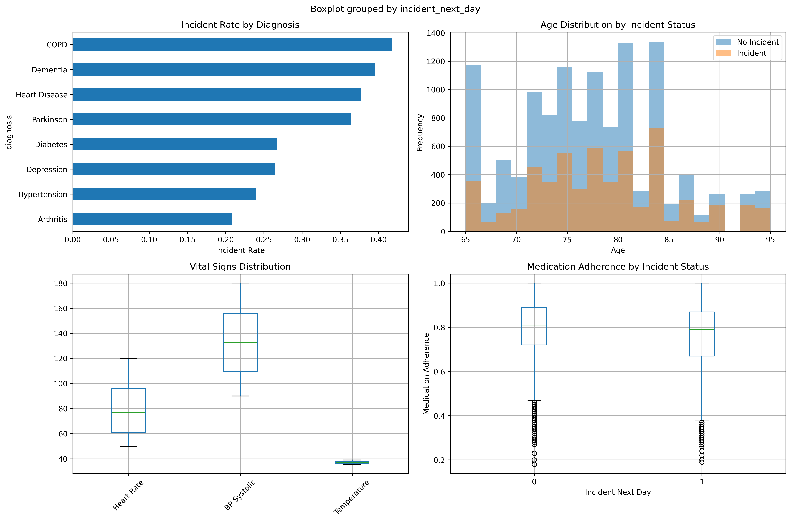
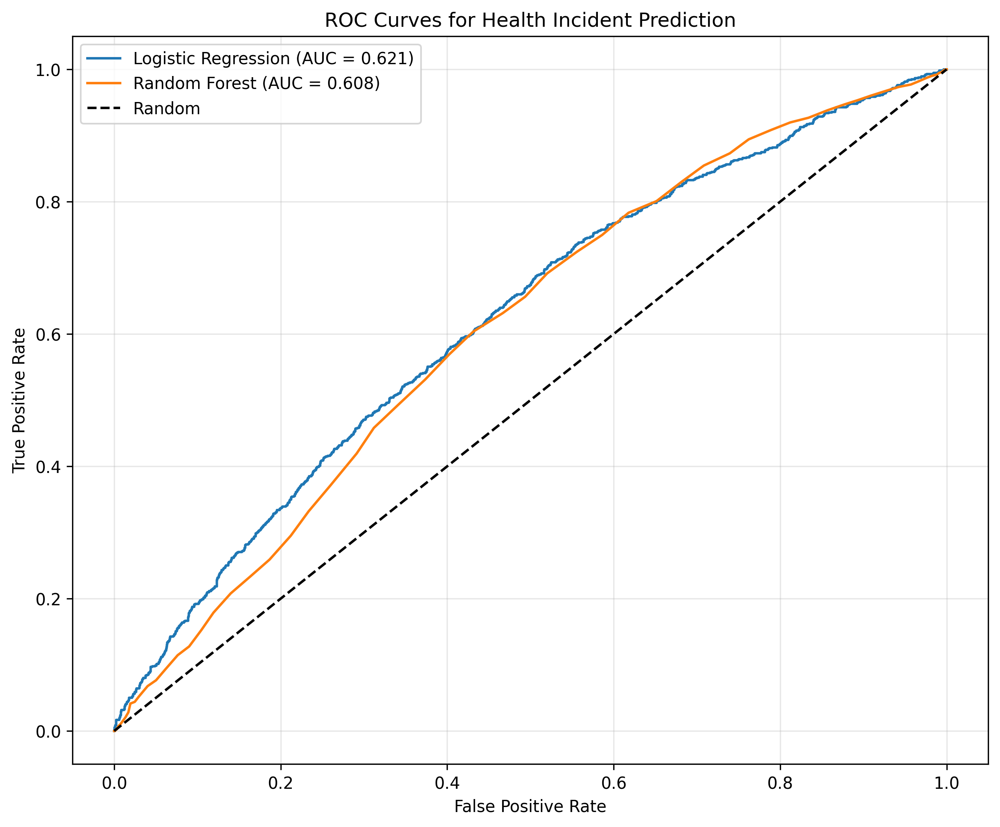
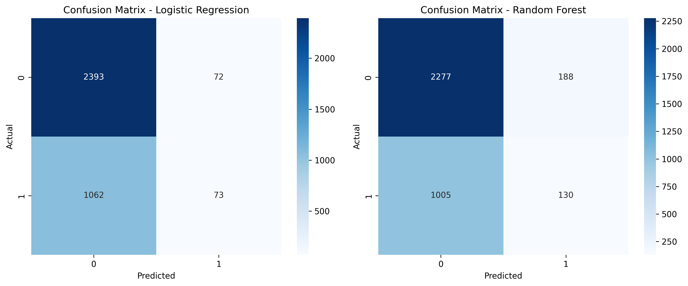
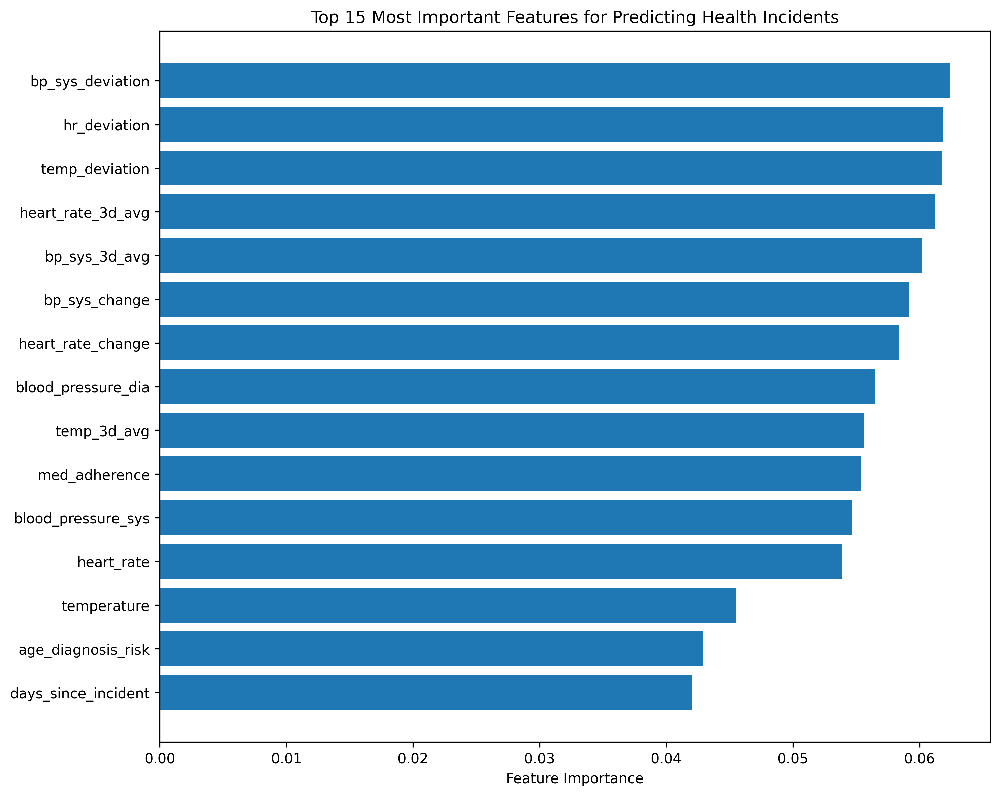

# ALF Health Incident Prediction Project

## 🏥 Project Overview

This project implements a machine learning solution to predict next-day health incidents for Assisted Living Facility (ALF) residents. By analyzing daily health metrics and patient characteristics, the model helps facility managers proactively identify at-risk residents and optimize resource allocation.

**Key Objective**: Predict `incident_next_day` (binary classification) to enable preventive interventions.

## 🎯 Quick Results Preview

<table>
<tr>
<td width="50%">

### Model Performance
- **Best Model**: Random Forest
- **AUC**: 0.608
- **Precision**: 40.9%
- **Key Finding**: Personal baseline deviations are strongest predictors

</td>
<td width="50%">

### High-Risk Groups
| Diagnosis | Incident Rate |
|-----------|--------------|
| COPD | 41.8% |
| Dementia | 39.5% |
| Heart Disease | 37.7% |
| Parkinson | 36.4% |

</td>
</tr>
</table>

## 📊 Dataset Description

The project uses synthetic data simulating real ALF health records with the following fields:

- **Patient Information**: `patient_id`, `facility_id`, `age`, `gender`, `diagnosis`
- **Vital Signs**: `heart_rate`, `blood_pressure_sys`, `blood_pressure_dia`, `temperature`
- **Care Metrics**: `med_adherence` (0.0 to 1.0 scale)
- **Target Variable**: `incident_next_day` (1 = incident, 0 = no incident)
- **Temporal**: `date` (YYYY-MM-DD format)

### Dataset Statistics:
- **200 unique patients** across 5 facilities
- **90 days** of daily records (January 1 - March 30, 2024)
- **18,000 total records**
- **31.4% incident rate** (class imbalance noted)

## 🔧 Installation & Setup

### Prerequisites
- Python 3.8+
- Git

### Clone and Setup
```bash
# Clone the repository
git clone git@github.com:karimdeif/alf-prj.git
cd alf-prj

# Create virtual environment
python3 -m venv venv

# Activate virtual environment
source venv/bin/activate  # On Windows: venv\Scripts\activate

# Install dependencies
pip install -r requirements.txt
```

## 🚀 Running the Analysis

### Generate Synthetic Data
```bash
python generate_alf_data.py
```

**Example Output:**
```
Generating synthetic ALF health data...
Adding derived features...
Data saved to: /home/karimdeif/alf_project/alf_health_data.csv

Dataset Summary:
Total records: 18000
Unique patients: 200
Date range: 2024-01-01 to 2024-03-30
Incident rate: 31.42%

Missing values:
heart_rate             361
blood_pressure_sys     525
blood_pressure_dia     525
temperature            208
...
```

This creates `alf_health_data.csv` with realistic patterns including:
- Diagnosis-specific incident rates
- Temporal correlations
- Missing values (1-7% for vital signs)

### Run Complete Analysis
```bash
python alf_health_analysis.py
```
This executes the full pipeline and generates all visualizations and models.
## 📈 1. Basic Data Exploration

The analysis performs comprehensive data exploration including:

### Missing Value Analysis
- **Heart rate changes**: 5.06% missing
- **Blood pressure changes**: 6.76% missing  
- **Temperature changes**: 3.39% missing
- **Vital signs**: 1-3% missing (realistic for clinical data)

### Key Distributions & Patterns
- **Age Distribution**: Mean age 78 years (range: 65-95)
- **Gender Split**: Balanced between Male/Female
- **Temporal Patterns**: Weekend vs weekday analysis included
- **Diagnosis Distribution**: 8 primary conditions tracked

### Incident Rate by Diagnosis
| Diagnosis | Incident Rate | Observations |
|-----------|--------------|--------------|
| COPD | 41.8% | Highest risk group |
| Dementia | 39.5% | Second highest risk |
| Heart Disease | 37.7% | Cardiovascular correlation |
| Parkinson | 36.4% | Neurological impact |
| Diabetes | 26.7% | Moderate risk |
| Depression | 26.5% | Mental health factor |
| Hypertension | 24.0% | Lower risk |
| Arthritis | 20.8% | Lowest risk group |

### Outlier Detection
- Vital signs checked against physiological ranges
- Extreme values capped (e.g., HR: 50-120 bpm)
- Patient-specific baselines established for anomaly detection

### Visualizations

#### Data Exploration

*Figure 1: Comprehensive data exploration showing incident rates by diagnosis, age distributions, vital signs, and medication adherence patterns*
## 🛠️ 2. Feature Preparation

### Engineered Features
The project creates 15+ additional features to enhance prediction:

#### Personal Baseline Deviations
- `hr_deviation`: Absolute deviation from patient's average heart rate
- `bp_sys_deviation`: Systolic BP deviation from personal baseline
- `temp_deviation`: Temperature deviation from normal

#### Temporal Features
- `heart_rate_3d_avg`: 3-day rolling average of heart rate
- `bp_sys_3d_avg`: 3-day rolling BP average
- `temp_3d_avg`: 3-day rolling temperature average
- `heart_rate_change`: Daily change in heart rate
- `bp_sys_change`: Daily change in systolic BP
- `temp_change`: Daily temperature change

#### Risk Indicators (Binary Flags)
- `high_hr`: Heart rate > 100 bpm
- `low_hr`: Heart rate < 60 bpm
- `high_bp`: Systolic BP > 140 mmHg
- `low_bp`: Systolic BP < 90 mmHg
- `fever`: Temperature > 37.5°C
- `low_med_adherence`: Medication adherence < 0.8

#### Composite Features
- `vital_risk_score`: Sum of all risk indicators (0-6 scale)
- `days_since_incident`: Days since last health incident
- `is_weekend`: Weekend indicator (different staffing patterns)
- `age_diagnosis_risk`: Interaction between age and diagnosis severity

### Missing Value Handling
- **Strategy**: Median imputation for vital signs
- **Rationale**: Preserves distribution, robust to outliers
- **Implementation**: Applied after feature engineering to maintain temporal relationships
## 🤖 3. Modeling

### Data Splitting Strategy
**Critical**: Patient-based splitting to prevent data leakage
- Uses `GroupShuffleSplit` to ensure patients don't appear in both train and test sets
- **80/20 split**: 160 patients training, 40 patients testing
- **Rationale**: Simulates real-world scenario where model predicts for new patients

### Models Trained
1. **Logistic Regression** (baseline model)
   - Simple, interpretable
   - Fast training and inference
   - Provides probability calibration baseline

2. **Random Forest** (primary model)
   - Handles non-linear relationships
   - Robust to outliers
   - Provides feature importance rankings
   - 100 trees with balanced class weights

### Model Evaluation Metrics

| Metric | Logistic Regression | Random Forest | Why This Metric? |
|--------|-------------------|---------------|------------------|
| **Accuracy** | 68.5% | 66.9% | Overall correctness |
| **Precision** | 50.3% | 40.9% | When model alerts, how often is it right? |
| **Recall** | 6.4% | 11.5% | What % of actual incidents are caught? |
| **F1-Score** | 11.4% | 17.9% | Balance of precision/recall |
| **AUC** | 0.621 | 0.608 | Overall discrimination ability |

### Why These Metrics?
- **AUC chosen as primary metric**: Handles class imbalance well
- **Precision important**: Minimize false alarms to prevent alert fatigue
- **Recall critical**: Missing real incidents has serious consequences
- **Trade-off**: Model is conservative (high precision, lower recall)

### Feature Scaling
- StandardScaler applied to all numeric features
- Ensures equal feature contribution
- Critical for Logistic Regression convergence

### Model Performance Visualizations

#### ROC Curves

*Figure 2: ROC curves comparing Logistic Regression (AUC=0.621) and Random Forest (AUC=0.608) models*

#### Confusion Matrices

*Figure 3: Confusion matrices showing the classification performance of both models on the test set*
## 💡 4. Insights

### Top 3 Most Important Features
Based on Random Forest feature importance:

1. **Blood Pressure Systolic Deviation (6.25%)** 
   - Deviations from personal baseline more predictive than absolute values
   - Indicates cardiovascular instability

2. **Heart Rate Deviation (6.19%)**
   - Personal baseline comparison crucial
   - Captures both tachycardia and bradycardia risks

3. **Temperature Deviation (6.18%)**
   - Even small deviations (>1°C) highly predictive
   - Early indicator of infection or inflammation

### Feature Importance Visualization

*Figure 4: Top 15 most important features from Random Forest model, showing dominance of vital sign deviations*

### Example Analysis Output
```
==================================================
3. MODELING
==================================================

Splitting data by patient to avoid data leakage...
Training set: 14400 records from 160 patients
Test set: 3600 records from 40 patients

Training Logistic Regression...
  Accuracy: 0.685
  Precision: 0.503
  Recall: 0.064
  F1-Score: 0.114
  AUC: 0.621

Training Random Forest...
  Accuracy: 0.669
  Precision: 0.409
  Recall: 0.115
  F1-Score: 0.179
  AUC: 0.608

==================================================
KEY INSIGHTS AND RECOMMENDATIONS
==================================================

1. TOP 3 MOST IMPORTANT FEATURES:
   - bp_sys_deviation: 0.062
   - hr_deviation: 0.062
   - temp_deviation: 0.062
```

### Practical Insights for Facility Managers

#### 🎯 Daily Monitoring Priorities
1. **Focus on Deviations, Not Absolutes**
   - Establish personal baselines for each resident
   - Flag deviations: HR >20 bpm, BP >20 mmHg, Temp >1°C
   
2. **High-Risk Patient Profiles**
   - COPD patients: 41.8% incident rate (2x average)
   - Dementia patients: 39.5% incident rate
   - Recent incident history: Higher recurrence risk
   - Medication adherence <70%: Strong predictor

3. **Intervention Timing**
   - Use 3-day trend analysis for early warning
   - Weekend periods need extra vigilance
   - Morning vital checks most predictive

#### 📋 Implementation Recommendations

1. **Risk Stratification Protocol**
   - Focus resources on top 20% risk scores
   - Daily review of high-risk residents
   - Automated alerts for threshold breaches

2. **Preventive Measures**
   - Medication adherence programs for at-risk patients
   - Enhanced monitoring for COPD/Dementia residents
   - Personalized vital sign thresholds

3. **Model Integration**
   - Use as decision support, not replacement for clinical judgment
   - Monthly retraining with new data
   - Track model performance metrics
   - Adjust thresholds based on facility-specific patterns

### Key Takeaway
**The model's strength lies in identifying deviations from personal baselines rather than absolute thresholds.** This aligns with clinical best practices and provides actionable insights for preventive care.
## 📁 Project Structure

```
alf-prj/
├── generate_alf_data.py              # Synthetic data generation with realistic patterns
├── alf_health_data.csv               # Generated dataset (18,000 records)
├── alf_health_analysis.py            # Main analysis pipeline
├── ALF_Health_Analysis_Notebook.py   # Notebook-style analysis with visualizations
├── ALF_Health_Incident_Prediction_Report.md  # Executive summary (2 pages)
├── README.md                         # This comprehensive guide
├── requirements.txt                  # Python dependencies
│
├── Models/
│   ├── rf_model.pkl                  # Trained Random Forest model
│   └── scaler.pkl                    # Feature standardization scaler
│
└── Visualizations/
    ├── exploration_plots.png         # Data distributions and patterns
    ├── roc_curves.png               # Model performance comparison
    ├── confusion_matrices.png        # Classification results
    └── feature_importance.png        # Top predictive features
```

## 📊 Key Results Summary

- **Dataset**: 200 patients × 90 days = 18,000 records
- **Incident Rate**: 31.4% (5,655 positive cases)
- **Best Model**: Random Forest with AUC 0.608
- **Top Insight**: Personal baseline deviations > absolute thresholds
- **High-Risk Groups**: COPD (41.8%) and Dementia (39.5%) patients

## 🔮 Future Enhancements

1. **Additional Data Sources**
   - Activity levels and mobility metrics
   - Laboratory results
   - Social engagement scores
   - Staff notes and observations

2. **Advanced Modeling**
   - Time-series specific models (LSTM, Prophet)
   - Patient-specific models for frequent fliers
   - Ensemble methods combining multiple algorithms
   - Real-time streaming predictions

3. **Deployment Features**
   - REST API for model serving
   - Dashboard for real-time monitoring
   - Mobile alerts for care staff
   - Integration with EHR systems

## 📚 References & Resources

- [Scikit-learn Documentation](https://scikit-learn.org/)
- [Pandas User Guide](https://pandas.pydata.org/docs/user_guide/index.html)
- Healthcare predictive modeling best practices
- HIPAA compliance for healthcare ML (Note: This uses synthetic data)

## 📧 Contact & Contributions

For questions, suggestions, or contributions:
- Open an issue on GitHub
- Submit pull requests for enhancements
- Follow coding standards in existing scripts

## 📄 License

This project is available for educational and research purposes. When using real patient data, ensure compliance with all applicable healthcare regulations and privacy laws.

---
**Last Updated**: August 2025
**Version**: 1.0.0